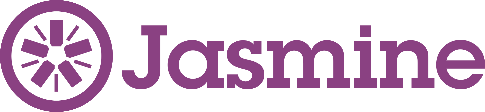
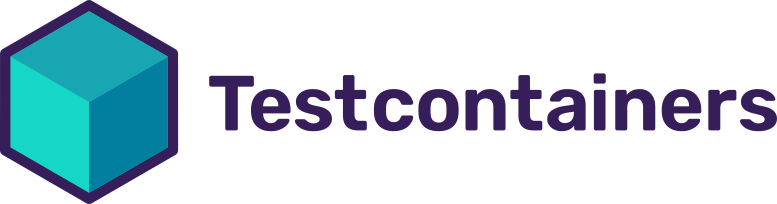
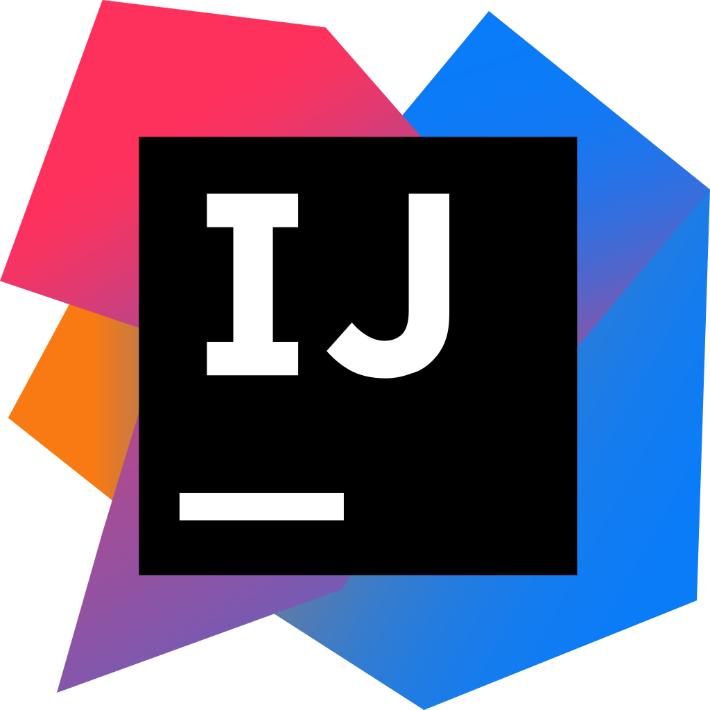
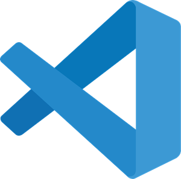
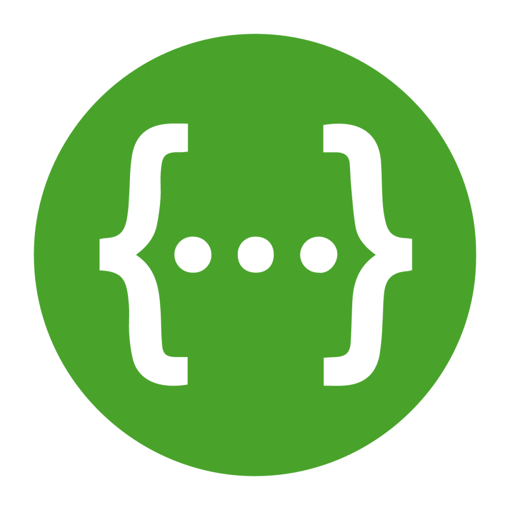
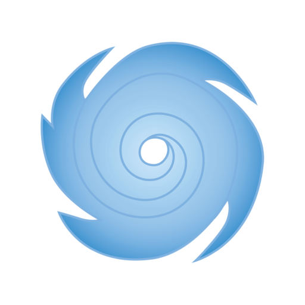

<h1>Greetings :wave: ! I am a full stack developer</h1>

As a holder of a Master's degree in Software Engineering, earned from the University of Rennes1 in France,
I have honed my skills in building robust and efficient applications as Full Stack Developer within 2 years of experiences.

I am fluent in French and English, in addition to my natice language, enabling me to work and adapt in multicultural environments.

<h1>My techs 🧰: </h1>

<h2>Front-end Frameworks 💻: </h2>

    
    
    
    
    

<h2>Back-end Frameworks 🌐💻: </h2>
 

    
    
    
 

<h2>Programing languages 👨‍💻: </h2>

    
    
    
    
    
    
    
    

<h2>Testing frameworks ⚗️: </h2>

  
  
  
  

<h2>Databases 🛢️: </h2>

  
  
  
  
  

<h2>Project management 🎯: </h2>

  
  
  
  
  

<h2>Others 🛠️️: </h2>

  
  

<h2>IDEs and tools 🛠️🧰️: </h2>

  
  
  
  
  

<h2>More about me : </h2>

- :books: I’m currently learning more about Kafka, Microservices, NestJS.
- 🤔 I’m looking for some advices about DevOps.
- 🎮 I play Tekken 8 and LoL.
- 😋 My favorite fruits are: strawberry :strawberry: blueberry :blueberries: orange :orange: pineapple :pineapple:
  lemon :lemon:

 

    
    

