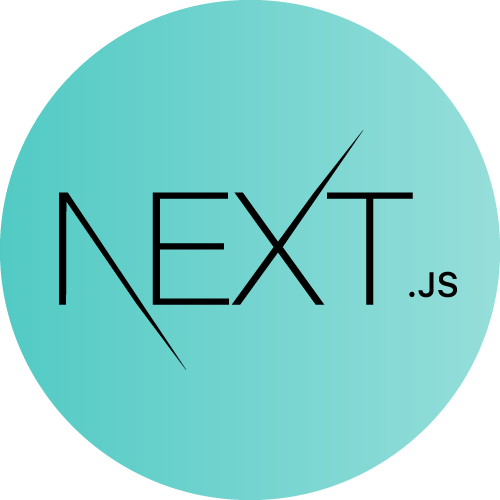

<h1>Hi :wave: ! I am a full stack developer</h1>

Passionnated by web application design, I take great care in the user experience, architecture and code quality of the apps I build .

My name is Andrian and I am a young graduate software engineer from the University of Rennes 1.

I am looking for new career opportunities, interested in M.E.R.N stack projects, but also open to learn new technologies.

<h1>My techs : </h1>
 
 <h2>Front-end : </h2>

        
        
        
        
        
        
         
        
        
        

 <h2>Back-end : </h2>
 

    
    
    
     
     
      
 

 <h2>Database : </h2>

<h2>Others : </h2>

        
        
        

<h2>More about me : </h2>

- :mortar_board: Second year of masters degree at the University of Rennes 1 as a software engineer
- :books: I’m currently learning more about VueJs, React, Angular, Symfony, Express, SpringBoot, Flutter
- 🤔 I’m looking for some advices about DevOps
- 😄 Pronouns: He/Him
- :guitar: Hobby : I like to play the guitar
- 😋 My favorite fruits are : strawberry :strawberry: blueberry :blueberries: orange :orange: pineapple :pineapple: lemon :lemon:

 

    

